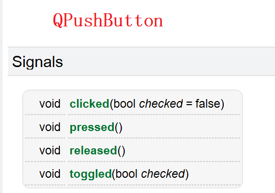
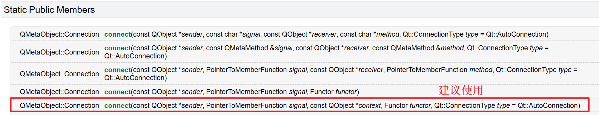
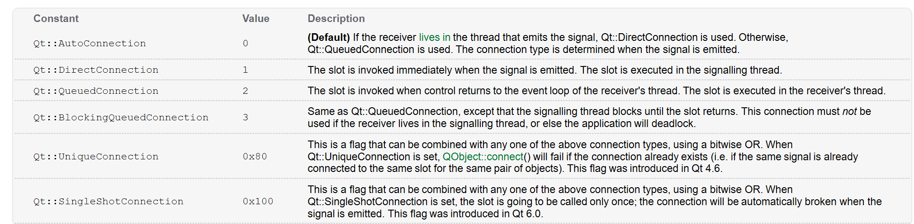
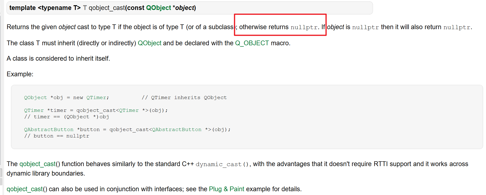

# 信号与槽

## 对象间通信
一般使用回调函数：Callback
```cpp
std::sort(vector.begin(),vector.end(),std::greater<int>());
```
## 对象模型
以下特性必须继承<font color=red>QObject</font>
1. 对象通信机制：信号和槽
2. 属性系统
3. 事件和事件过滤器
4. 文本国际化
5. 定时器
6. 对象树，对象所有权:  能自动释放
7. 守卫指针QPointer: 指针指向的对象被释放后，指针自动置为nullptr

```cpp
//指针必须先赋初值
int *p = nullptr;
if(p == nullptr)
{
    P = new int(10);
}

//结束后一定要手动删除
delete p；
p = nullptr；
```

## 基本条件

The <font color=red>meta-object system</font> is based on three things:
1. The QObject class provides a base class for objects that can take advantage of the meta-object system.
2. The Q_OBJECT macro inside the private section of the class declaration is used to enable meta-object features, such as dynamic properties, signals, and slots.
3. The Meta-Object Compiler (moc) supplies each QObject subclass with the necessary code to implement meta-object features.

## 操作方法
1. 声明一个信号
2. 声明一个槽
3. 将信号和槽连接起来

```cpp
//声明信号，命名规则：首字母小写
signals:
    void mySignal(int);

//声明槽，命名规则：习惯 on 开头
protected slots:
    void onMySlot(int);
```





<font color=red>注意不要使用SIGNAL()和SLOT()宏</font>
```cpp
//connect(谁发送, 发送的信号, 谁接收, 接收处理函数, 连接方式)；
connect(this, &MyWidget::mySignal, 
        this, &MyWidget::onMySlot, Qt::AutoConnection);

```


连接方式



```cpp
//发射信号
emit mySignal(value);
```

```cpp
#include <QTimer>
//延时3s发送信号，只执行一次
QTimer::singleShot(3000, this,[this](){emit mySignal(250);});
//按值捕获
QTimer::singleShot(10, this,[=,this](){emit mySignal();});
//按引用捕获
QTimer::singleShot(10, this,[&,this](){emit mySignal();});
```



```cpp
MyWidget::mySlot(int value)
{
    auto s=qobject_cast<QPushButton*>(sender());
    if(s！=nullptr)
    {
        qDebug()<<s->objectName();
        return;
    }
}
```

```cpp
//连接定时器
timer = new QTimer(this);
timer->setInterval(1000);
connect(timer, &QTimer::timeout, this, [&,this](){
    emit mySignal();
    ui->pushButton->clicked();});
```
## 信号与槽连接方式
1. 一对一
2. 一对多
3. 多对一
4. 多对多

## 属性系统
```cpp
Q_PROPERTY(QString name READ name WRITE setName NOTIFY nameChanged FINAL)
```

扩展：UML建模